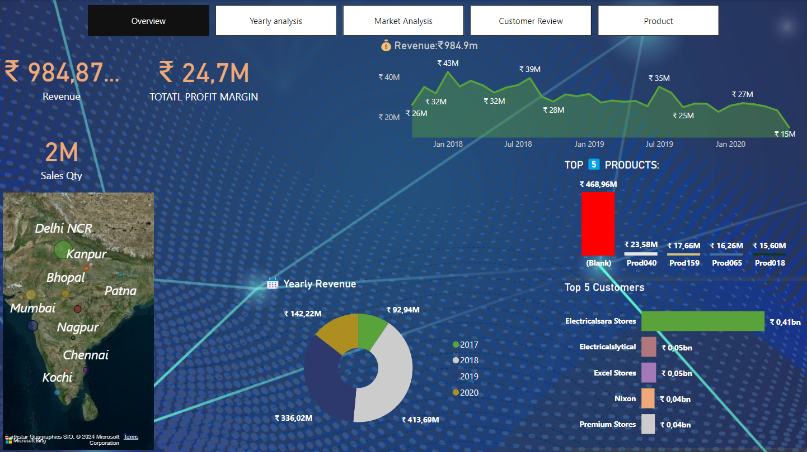

# PowerBi sales analysis project
## A Microsoft Power BI, Dashboard showing information regarding sales of A company over 4 years(2017-2020).
### Dashboard consists of 5 slides.
## OVERVIEW

- It shows information such as Revenue, Total profit margin, Total sales, Revenue trend chart by Month, Total Revenue pi-chart by year, Top 5 products and customers by Revenue, and size of markets on the map where the size of the circle depicts revenue generated from that city.
